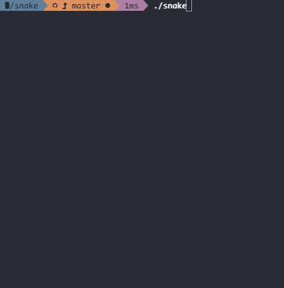

# snake
A snake implementation in Go

Gameplay at 2x speed on a 24x24 board:<br>


## Usage
```
Usage of snake:
  -height int
    	the height of the board (default 32)
  -tick-interval duration
    	the tick interval (default 100ms)
  -width int
    	the width of the board (default 32)
```
